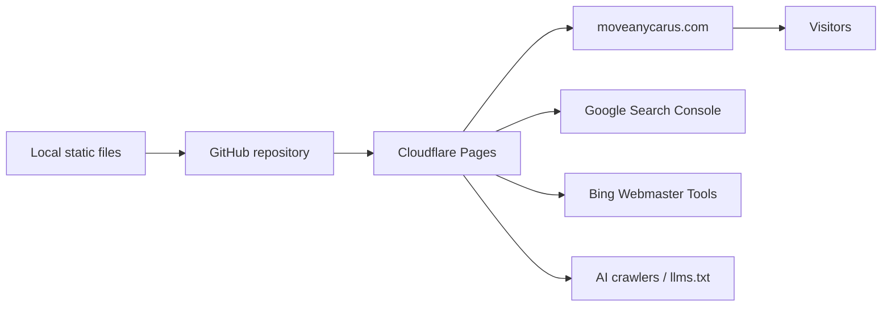

# Zero-cost deployment plan

Recommended production setup:

- Hosting: Cloudflare Pages free plan
- Source control: GitHub free private or public repository
- Domain/DNS: Cloudflare DNS
- SSL: Cloudflare-managed HTTPS
- Build step: none
- Monthly hosting cost: $0

## Architecture

## Cloudflare Pages settings

Use these settings when creating the Pages project:

- Framework preset: `None`
- Build command: leave empty
- Build output directory: `/`
- Root directory: `/`
- Production branch: `main`

## Custom domain

After the first deployment works:

1. In Cloudflare Pages, open the project.
2. Go to `Custom domains`.
3. Add `moveanycarus.com`.
4. Add `www.moveanycarus.com`.
5. Set a redirect rule so `www.moveanycarus.com/*` redirects to `https://moveanycarus.com/$1`.

## DNS cutover

Keep Bluehost active until Cloudflare shows the custom domain as active.

When ready:

1. Move DNS for `moveanycarus.com` to Cloudflare, or update the existing registrar nameservers to Cloudflare.
2. Confirm HTTPS works at `https://moveanycarus.com/`.
3. Confirm these files load:
   - `https://moveanycarus.com/sitemap.xml`
   - `https://moveanycarus.com/robots.txt`
   - `https://moveanycarus.com/llms.txt`
   - `https://moveanycarus.com/business-profile.json`
4. Submit the sitemap in Google Search Console and Bing Webmaster Tools.
5. Cancel Bluehost only after the new site is live and indexed.

## Direct upload option

If GitHub is not ready yet, upload the ZIP file generated from this folder to Cloudflare Pages using `Upload assets`.

This is still $0/month, but GitHub integration is easier to maintain long-term.

